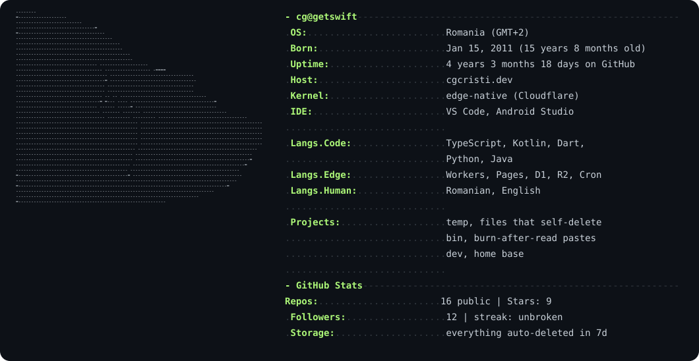

<h3 align="center">fullstack dev from Romania — I ship fast, and let things expire faster</h3>

  
  
  
  
  

  

---

### what I build

Mostly **throwaway infrastructure** — things that delete themselves so nothing rots. All edge, no servers to babysit: Cloudflare Workers + D1 + R2 on the back, Next.js + TypeScript on the front.

- **[temp.getswift.cloud](https://temp.getswift.cloud)** — drop a file, get a link. auto-deletes in 7 days or less. google sign-in, password + recipient-only links, public API, analytics.
- **[bin.getswift.cloud](https://bin.getswift.cloud)** — pastebin with burn-after-read, forks, and raw endpoints.
- **[cgcristi.dev](https://cgcristi.dev)** — my corner of the internet.

### favorite public repos

| repo | about | written in |
|---|---|---|
| [pigeonsms](https://github.com/realcgcristi/pigeonsms) | chat app — android client, cloudflare workers backend. dms, spaces, calls, the works. | kotlin |
| [nextfin](https://github.com/realcgcristi/nextfin) | a jellyfin client for android | dart |
| [StreamFlareUI](https://github.com/realcgcristi/StreamFlareUI) | streamflare, but with a UI | python |
| [MINL](https://github.com/realcgcristi/MINL) | *(maybe in a new life)* — 1.21.x minecraft mod that makes mobs friendly | java |
| [avSudo](https://github.com/realcgcristi/avSudo) | sudo for termux on unrooted devices, as a .deb | shell |

### actually in my toolbox

  
  
  
  
  
  
  
  
  

---

  

<i>ship it, let it expire, move on.</i>

